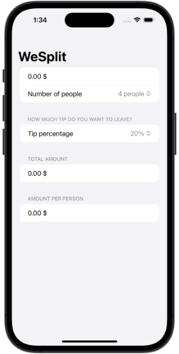

# 100-days-of-swiftui

Every completed project from Paul Hudson's "100 days of SwiftUI"

https://www.hackingwithswift.com/100/swiftui

Projects / Topics                                    | Screenshots
---          |---
[Project 1](01-Project1-WeSplit) - *WeSplit*  (with challenges)   Form, Section, NavigationView, @State property wrapper, TextField, Picker, ForEach  | |
[Project 2](02-Project2-GuessTheFlag) - *Guess the Flag*  (with challenges)   VStack, Image, Alert  |  |
[Project 3](03-Project3-ViewsAndModifiers) - *View and Modifiers*  (with challenges)   Views, modifiers, composition, containers  |  |
[Milestone Projects 1-3](04-Milestone-Projects-1-3-RockPaperScissors) - *Rock Paper Scissors*  | |
[Project 4](05-Project4-BetterRest) - *BetterRest*  (with challenges)   Machine Learning, Dates (DatePicker, DateComponents, DateFormatter) Stepper, navigationBarItems()  |  |
[Project 5](06-Project5-WordScramble) - *Word Scramble*  (with challenges)   List, onAppear, Bundle, fatalError(), UITextChecker  |  |
[Project 6](07-Project6-Animations) - *Animations*  (with challenges)   Animations and transitions  | |
[Milestone Projects 4-6](08-Milestone-Projects-4-6-Edutainment) - *Multiplication Tables*  |  |
[Project 7](09-Project7-iExpense) - *iExpense*  (with challenges)   UserDefaults, Codable, sheet(), onDelete(), @ObservedObject  |  |
[Project 8](10-Project8-Moonshot) - *Moonshot*  (with challenges)   GeometryReader, ScrollView, Navigation, Codable hierarchy, Generics  |  |
[Project 9](11-Project9-Drawing) - *Drawing*  (with challenges)   Paths, shapes, strokes, transforms, drawing groups, animating values, Core Animation, Metal  |  |
[Milestone Projects 7-9](12-Milestone-Projects-7-9-Habit) - *Habit Tracker*  |  |
[Project 10](13-Project10-CupcakeCorner) - *Cupcakes Corner*  (with challenges)   Codable, URLSession, disabled()  |  |
[Project 11](14-Project11-Bookworm) - *Bookworm*  (with challenges)   Core Data, @Binding, Custom components  |  |
[Project 12](15-Project12-CoreDataProject) - *Core Data*  (with challenges)   Core Data  |  |
[Milestone Projects 10-12](16-Milestone-Projects-10-12-Friendface) - *Users listing*  |  |
[Project 13](17-Project13-Instafilter) - *Instafilter*  (with challenges)   UIKit integration, Core Image, Custom bindings, Action Sheets  |  |
[Project 14](18-Project14-BucketList) - *Bucket List*  (with challenges)   MapKit, Biometric authentication, Secure data writing, Comparable custom types, Documents directory  |  |
[Milestone Projects 13-15](19-Milestone-Projects-13-15-Meetup) - *Event Contacts*  |  |
[Project 16](20-Project16-HotProspects) - *Hot Prospects*  (with challenges)   Custom environment objects, Tab Views, Result, objectWillChange, Image interpolation, Context menus, Local notifications, Swift package dependencies, filter(), map()  |  |
[Project 17](21-Project17-Flashzilla) - *Flashzilla*  (with challenges)   Gestures, haptics, Combine, timers, accessibility  |  |
[Project 18](22-Project18-LayoutAndGeometry) - *Layout and Geometry*  (with challenges)   Layout, alignment, geometry, positioning  |  |
[Milestone Projects 16-18](23-Milestone-Projects-16-18-DiceRoll) - *Roll the Dice*  |  |
[Project 19](24-Project19-SnowSeeker) - *SnowSeeker*  (with challenges)   Split view layouts, optional alerts, flexible layouts with Group, ListFormatter  |  |
